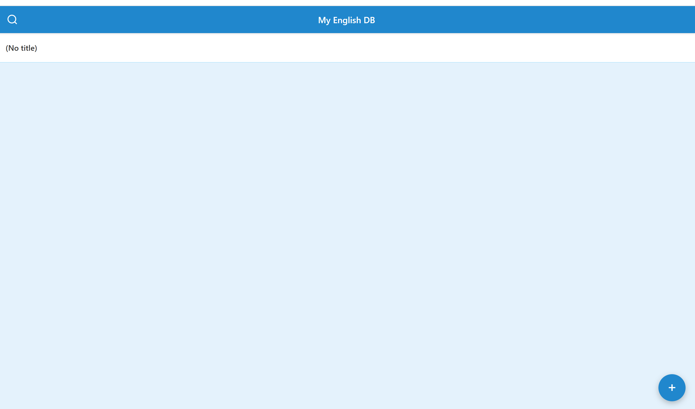

# My English DB

It is a tool for me to learn English words or chunks in efficient way.



## function

- list words and chunks ,in addition to your own languages something.
- add context below in free ways.
- slide list to sort,edit delete

## stack

- React 19 / TypeScript
- Vite 7
- PWA（vite-plugin-pwa）

##　the part that I thought into

- responsive
- simple
- native like

## set up
```bash
npm install
npm run dev
```

- build: `npm run build`
- preview: `npm run preview`