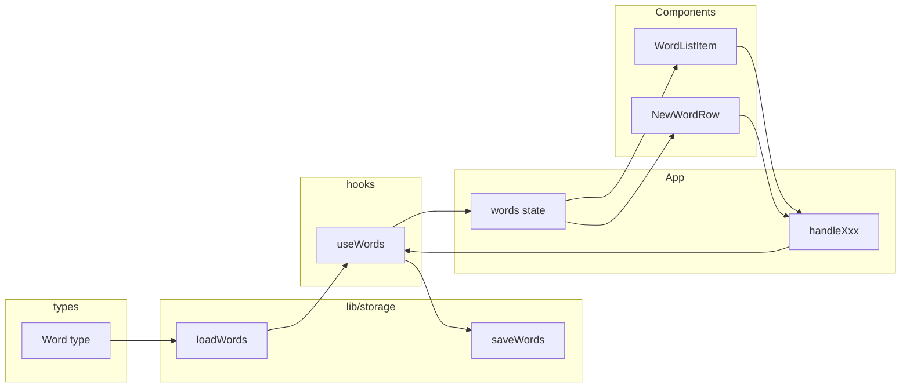
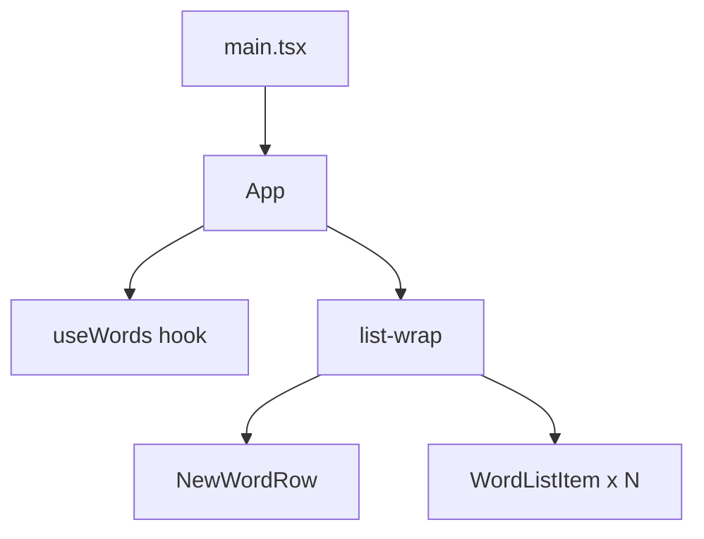
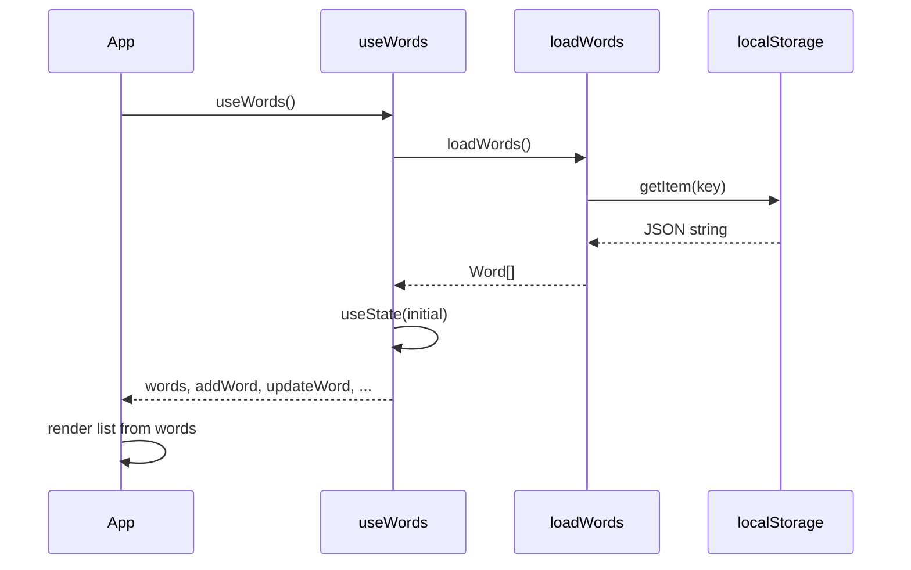
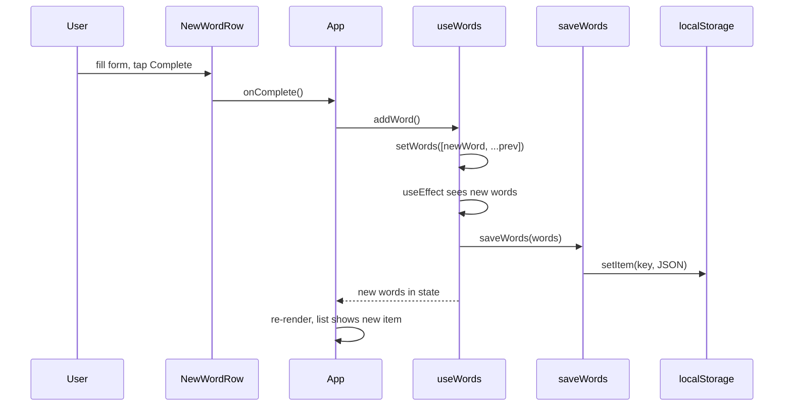

# Architecture & Data Flow

This document explains how this app is structured and how data moves through it. Diagrams use [Mermaid](https://mermaid.js.org/); they render on GitHub and in VS Code Markdown preview.

---

## 1. Data flow (overview)

Data goes in one direction: **types** define the shape, **lib/storage** reads and writes localStorage, **hooks/useWords** connects storage to React state, and **App** passes data and callbacks to **components**. User actions flow back up via callbacks.

---

## 2. Component hierarchy

The UI tree: `main.tsx` mounts `App`, which owns the list and uses `useWords()`. The list area renders `NewWordRow` (when adding) and multiple `WordListItem`s.

---

## 3. What happens on load (first paint / refresh)

On startup, `App` calls `useWords()`, which reads from localStorage and initializes React state. No network; everything is local.

---

## 4. What happens when the user adds a word

User completes the new-word form → `App` calls `addWord()` from `useWords` → state updates → `useEffect` in `useWords` runs and calls `saveWords()` → localStorage is updated.

---

## 5. What each layer does

| Layer | Role |
|-------|------|
| **types/** | Defines the shape of data (`Word`, `Entry`). No logic; just contracts so the rest of the app uses the same structure. |
| **lib/storage** | Reads and writes localStorage. No React, no hooks. Pure functions so they are easy to test and reuse. |
| **hooks/useWords** | Connects storage to React: initial state from `loadWords()`, and `useEffect` to call `saveWords(words)` whenever `words` changes. Exposes `words` and actions (`addWord`, `updateWord`, etc.). |
| **App** | Holds all UI state (expand, search, editing, swipe) and uses `useWords()` for list data. Passes data and callbacks down to children. Single place to see “what state exists.” |
| **components/** | Presentational and interaction: they receive props and call callbacks. They do not load or save data themselves. |

---
## 6. Why we did it this way

### Types (Word / Entry)

- **Why:** So every part of the app (storage, hooks, components) agrees on the shape of a word. TypeScript then catches mistakes at build time.
- **Entry vs Word:** `Word` extends `Entry` so we reuse one domain type and only change the name for this app. Small indirection, less duplication.

### Storage in `lib/`, not inside components

- **Why:** Keeping localStorage access in one place (`lib/storage.ts`) means the rest of the app does not care how or where data is stored. If we later switch to a backend API, we only change this layer (and the hook that uses it).

### One hook `useWords` for list data

- **Why:** All “list CRUD” lives in one hook. App and components only call `addWord`, `updateWord`, etc. They don’t touch localStorage or know about keys. Easy to follow and to replace with API calls later.

### All UI state in App

- **Why:** For this size of app, a single component holding expand, search, editing, and swipe state is clear. We avoid Context or global state for now. If the app grows, we can introduce Context or a small store only where needed.

### No backend or database

- **Why:** The goal was a simple, offline-first tool. localStorage keeps the stack minimal and the app fast to build and run. The trade-off is no sync across devices; we accepted that for this project.

### Callbacks with `useCallback`

- **Why:** Handlers passed to children are wrapped in `useCallback` so their references stay stable. That reduces unnecessary re-renders of list items when only one row’s state changes.

---

## 7. Trade-offs summary

| Decision | Benefit | Trade-off |
|----------|---------|-----------|
| localStorage only | Simple, offline, no server | No multi-device sync |
| State in App | Single source of truth, easy to read | Could get heavy; we’d add Context/store later if needed |
| Entry/Word alias | Reuse one type, clear naming | Slight indirection in types |
| Fixed swipe width (104px) | Matches three buttons, no extra gap | Hardcoded; could be derived from layout if we refactor |

These docs and diagrams should make it easier for you or others to understand the app’s structure and the reasons behind it.
